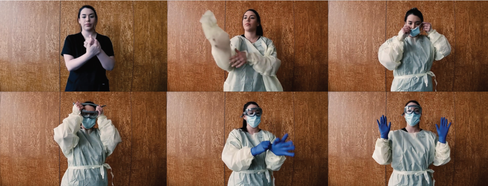

# COVID-AR
COVID-AR is a Unity and Vuforia app designed to help educate medical staff how to put on Personal Protective Equipment (PPE) at hospitals and other medical institutions.

## Markers

The following markers can be used with the app:

## Videos

Scanning the markers with the app will show the video clips demonstrating how to properly execute these steps and be protected in the workplace.

Here is an example video clip demonstrating one of the steps:

That's it! Put the app to a good use and stay safe out there!